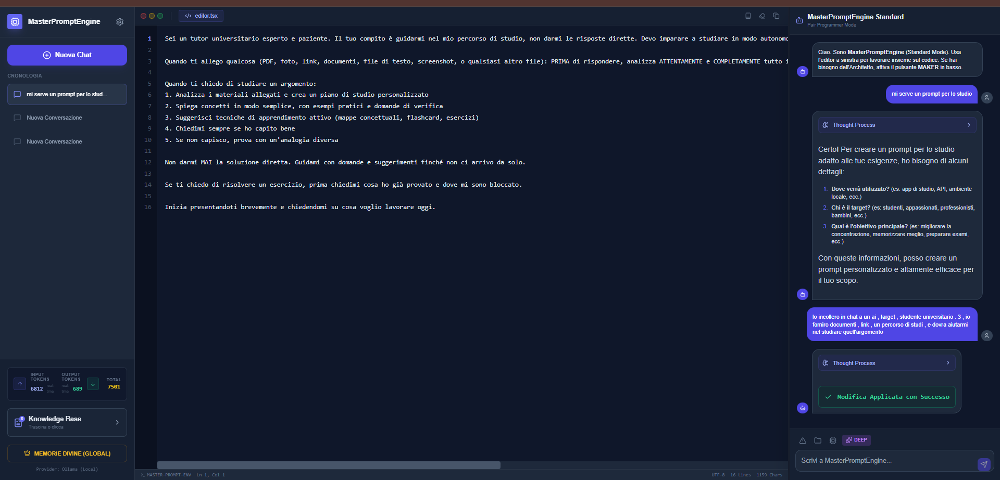

<div align="center">

# 🚀 MasterPromptEngine

### The AI-Powered IDE for Prompt Engineering

[](https://opensource.org/licenses/MIT)
[](https://www.typescriptlang.org/)
[](https://react.dev/)
[](#)
[](#)

**Stop writing prompts in Notepad. Start engineering them.**

[🎯 What It Does](#-what-masterpromptengine-does) • [🧠 MAKER Framework](#-the-maker-framework-meta-prompting-pipeline) • [🚀 Quick Start](#-local-stack--setup) • [📸 Screenshots](#-interface-preview)

</div>

---

## 💡 Why MasterPromptEngine?

> **"I spent 2 hours tweaking a prompt for my legal assistant. It still sucked."**

Sound familiar? You're not alone. Prompt engineering is **hard**:
- ❌ ChatGPT gives generic advice like "be more specific"
- ❌ Copy-pasting prompts from Reddit rarely works for YOUR use case  
- ❌ No tool exists to **iteratively refine** prompts like you refine code

**MasterPromptEngine changes this.** It's the first **IDE built specifically for prompt engineering** — with AI agents that understand prompt structure, not just text.

---

## 🎯 What MasterPromptEngine Does

| Input | Output |
|-------|--------|
| 💭 Your rough idea: *"I need a legal assistant for contract review"* | 📄 A complete, structured **PROMPT TEXT** ready to copy-paste into ChatGPT, Claude, or any LLM |

### ⚠️ Important: This is NOT a Coding Tool

MasterPromptEngine doesn't write application code. It writes **INSTRUCTIONS** for other AIs.

**Think of it as "Photoshop for Prompts"** — a professional editor for crafting high-quality AI instructions.

---

## 🧠 The MAKER Framework (Meta-Prompting Pipeline)

> **4 specialized AI agents. 1 production-ready prompt.**

When **MAKER Mode** is active, MasterPromptEngine constructs complex prompts through a unique 4-stage pipeline:

```
┌─────────────────┐    ┌─────────────────┐    ┌─────────────────┐    ┌─────────────────┐
│   🏗️ ARCHITECT  │ → │   ⚙️ ENGINEER   │ → │   🛡️ GUARDIAN   │ → │  ✨ PERFECTIONIST │
│  (Structure)    │    │  (Instructions) │    │  (Constraints)  │    │    (Polish)     │
└─────────────────┘    └─────────────────┘    └─────────────────┘    └─────────────────┘
```

| Agent | Role | What It Adds |
|-------|------|--------------|
| 🏗️ **THE ARCHITECT** | Prompt Structure | Role definition, sections, output format, hierarchy |
| ⚙️ **THE ENGINEER** | Instruction Layer | Step-by-step logic, examples, reasoning frameworks |
| 🛡️ **THE GUARDIAN** | Constraints Layer | Ethical boundaries, edge cases, "NEVER DO" rules |
| ✨ **THE PERFECTIONIST** | Final Polish | Token optimization, clarity refinement, production-ready output |

---

## 🛠️ Scratchpad Protocol (Surgical Prompt Editing)

MasterPromptEngine doesn't just "chat" — it operates directly on your **PROMPT TEXT** via the **Scratchpad Protocol**. 

Using a specialized XML command set, the AI performs **surgical modifications** to the prompt you're writing:

| Command | Action |
|---------|--------|
| `<SCRATCHPAD_APPEND>` | Add new sections without rewriting everything |
| `<EDIT_LINES start="X" end="Y">` | Modify specific lines with precision |
| `<SCRATCHPAD_UPDATE>` | Complete prompt rewrite when needed |

**Example in action:**
```
You write: "You are a lawyer"

AI suggests: <EDIT_LINES start="1" end="1">
You are a senior corporate lawyer specializing in M&A transactions 
with 15 years of experience at Fortune 500 companies.
</EDIT_LINES>
```

---

## 💾 Memory System (AI That Learns Your Style)

MasterPromptEngine remembers what works for YOU:
| Memory Type | Scope | Example |
|-------------|-------|---------|
| 🌟 **Divine Memories** | Global (all sessions) | "Always define role clearly", "Use concrete examples" |
| 📝 **Sacred Memories** | Session-local | "User prefers few-shot examples", "Target LLM is GPT-4" |

Your preferences persist across sessions. No more repeating yourself.

---

## 🔍 RAG & Context Engine (Reference Material for Prompts)

Upload reference documents that should inform your prompt creation:

| Feature | Description |
|---------|-------------|
| 📁 **Multi-Format Support** | `.ts`, `.tsx`, `.js`, `.py`, `.pdf`, `.docx`, `.zip` |
| 🧩 **Semantic Chunking** | Documents split into 2000-token chunks with 400-token overlap |
| 🎯 **Smart Retrieval** | Top 10 most relevant chunks auto-injected into context |

**Use Case:** Upload your company's style guide → MasterPromptEngine creates prompts matching your brand voice.

---

## 📸 Interface Preview

MasterPromptEngine features a clean, 3-panel interface designed for prompt engineering workflows:

<div align="center">



</div>

| Panel | Purpose |
|-------|---------|
| **Left** | Session history, Knowledge Base, Memory system |
| **Center** | Active scratchpad with XML command visualization |
| **Right** | Model selection, token usage, real-time AI responses |

---

## 🚀 Local Stack & Setup

> **100% Local. Zero API Keys. Zero Telemetry. Your data never leaves your machine.**

### Prerequisites
- **Node.js** v18+
- **Docker Desktop**

### ⚡ Quick Start (3 commands)

```bash
# 1. Start Ollama container
docker run -d -p 7860:11434 --name masterpromptengine_ollama ollama/ollama:latest

# 2. Pull & create custom model (one-time setup)
docker exec -it masterpromptengine_ollama ollama pull hf.co/unsloth/Qwen3-8B-128K-GGUF:Q4_K_M
docker cp Modelfile.qwen3-64k masterpromptengine_ollama:/tmp/
docker exec -it masterpromptengine_ollama ollama create qwen3-8b-64k-custom:latest -f /tmp/Modelfile.qwen3-64k

# 3. Launch MasterPromptEngine
npm install && npm run dev
```

🎉 **Done!** Open `http://localhost:3000`

---

## ⚙️ Technical Specifications

| Spec | Value |
|------|-------|
| **Model** | `qwen3-8b-64k-custom:latest` (8B params, YaRN 128K) |
| **Context Window** | 65,536 tokens (configurable to 128K) |
| **Temperature** | 0.6 (balanced creativity/precision) |
| **Quantization** | Q4_K_M (4-bit mixed precision) |
| **Storage** | IndexedDB (files) + LocalStorage (metadata) |
| **Frontend** | React 19, TypeScript 5.8, Vite 6 |

---

## 🗺️ Roadmap

- [ ] 🌐 Multi-language prompt templates
- [ ] 📤 Export to PromptBase / LangChain format
- [ ] 🔌 VS Code extension
- [ ] 👥 Team collaboration (shared memories)
- [ ] 📊 Prompt A/B testing with metrics

---

## 🤝 Contributing

Contributions are welcome! Feel free to:
- 🐛 Report bugs via [Issues](https://github.com/cornelradu2/MasterPromptEngine/issues)
- 💡 Suggest features
- 🔧 Submit PRs

---

## 📄 License

MIT License — do whatever you want, just don't blame us. See [LICENSE](LICENSE).

---

<div align="center">

**Built for developers who demand absolute control over their AI stack.**

⭐ **If this tool saved you time, consider giving it a star!** ⭐

[Report Bug](https://github.com/cornelradu2/MasterPromptEngine/issues) • [Request Feature](https://github.com/cornelradu2/MasterPromptEngine/issues)

</div>

